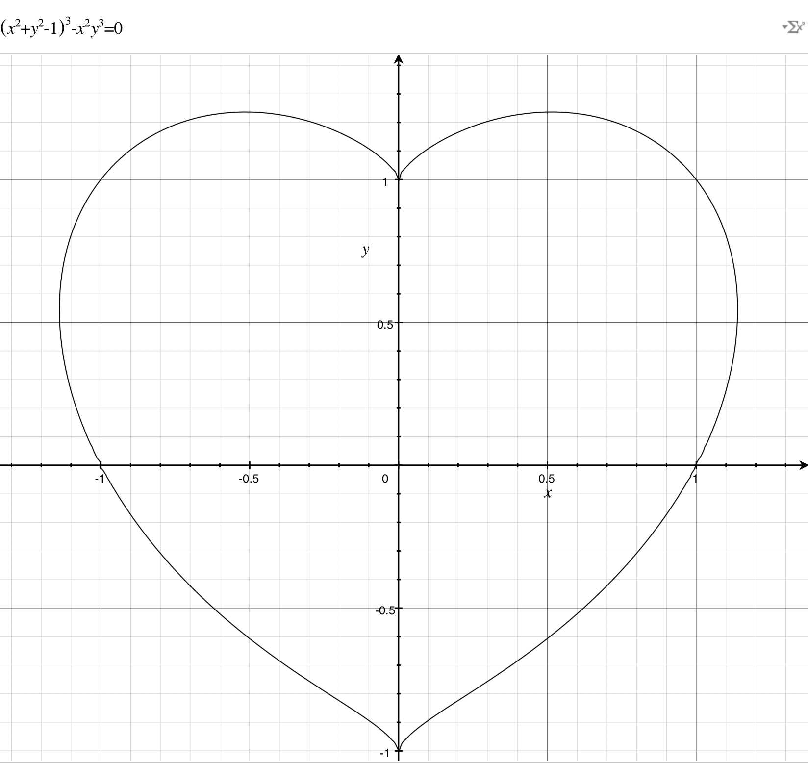
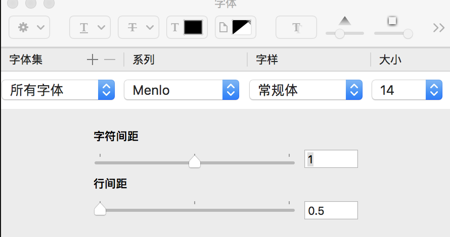

# HeartMaze

Java编写的心形迷宫+深度寻路。参考[原创C语言版](https://github.com/neolay/HeartMaze)。

结果1:

结果2:


## 1. 生成心形线

函数：(x^2 + y^2 - 1)^3 - x^2 y^3 = 0

心形内，函数值小于0；心形外，函数值大于0。

图形：


代码：

```java
private void initHeart() {
	int row = 1, col = 0;
	for (double y = 1.2f; y >= -1.0f; y -= 0.06f) {
		for (double x = -1.2f; x <= 1.2f; x += 0.05f) {
			double temp = Math.pow(x, 2) + Math.pow(y, 2) - 1;
			if (Math.pow(temp, 3) - Math.pow(x, 2) * Math.pow(y, 3) <= 0.0)
				heart[row][col] = true;
			else
				heart[row][col] = false;
			col++;
		}
		row++; col = 0;
	}
}
```

## 2. 生成迷宫轮廓

2.1 格子本身处于心形线并且上下左右的格子有不在心形线内的格子即为心形轮廓（OUTWALL）。

```java
if (heart[i][j] && !(heart[i - 1][j] && heart[i + 1][j] && heart[i][j - 1] && heart[i][j + 1])) {
	maze[i][j] = eBLOCK.OUTWALL;
} 
```

2.2 心形内部偶数为路（ROAD），基数为内墙（INWALL）。


```java
else if (heart[i][j] && i % 2 == 0 && j % 2 == 0) {
	maze[i][j] = eBLOCK.ROAD;
}
else if (heart[i][j]) {
	maze[i][j] = eBLOCK.INWALL;
}
```

2.3 其余为空（EMPTYWALL）。


```java
else {
	maze[i][j] =  eBLOCK.EMPTYWALL;
}
```

2.4 定义入口、出口为路。


```java
maze[IN.row][IN.col] = eBLOCK.ROAD;
maze[OUT.row][OUT.col] = eBLOCK.ROAD;
```

## 3. 更新迷宫

3.1 通过随机广度优先搜索进行迷宫更新，保证迷宫入口到迷宫出口的通路。

迷宫入口为队列第一个Block，`list.add(IN);`，随后将上、下、左、右四个方向的未访问Block加入队列，并打通当前Block及其上、下、左、右Block之间的墙。循环随机抽取Block，直到队列为空。


```java
private void randomBFS(List<Block> list, boolean[][] visited) throws Exception
```

3.2 动态生成

通过去除遮罩的方式可以模拟迷宫的动态生成。通过去除每个进入队列的Block及其周围Block的遮罩达到效果。

```java
private void removeMask(Block block) {
	for (int i = block.row-1; i <= block.row+1; i++)
		for (int j = block.col-1; j <= block.col+1; j++) {
			if (i >= 0 && i < ROW && j >= 0 && j <COL) {
				unmask[i][j] = true;
			}
		}
}
```

## 4. 绘制迷宫

4.1 通过Lanterna进行终端重定位，以保证绘制动画的连续。

Lanterna is a Java library allowing you to write easy semi-graphical user interfaces in a text-only environment, very similar to the C library curses but with more functionality. [下载地址](http://central.maven.org/maven2/com/googlecode/lanterna/lanterna/3.0.1/lanterna-3.0.1.jar)


```java
Teriminal terminal = new UnixTerminal();
terminal.setCursorPosition(0, 0);
```

4.2 方块颜色

zsh下可以通过以下方式实现不同颜色的控制台输出。

```java
public static final String ANSI_RESET = "\u001B[0m";
public static final String ANSI_BLACK = "\u001B[30m";
public static final String ANSI_RED = "\u001B[31m";
public static final String ANSI_GREEN = "\u001B[32m";
public static final String ANSI_YELLOW = "\u001B[33m";
public static final String ANSI_BLUE = "\u001B[34m";
public static final String ANSI_PURPLE = "\u001B[35m";
public static final String ANSI_CYAN = "\u001B[36m";
public static final String ANSI_WHITE = "\u001B[37m";

public static final String ANSI_BLACK_BACKGROUND = "\u001B[40m";
public static final String ANSI_RED_BACKGROUND = "\u001B[41m";
public static final String ANSI_GREEN_BACKGROUND = "\u001B[42m";
public static final String ANSI_YELLOW_BACKGROUND = "\u001B[43m";
public static final String ANSI_BLUE_BACKGROUND = "\u001B[44m";
public static final String ANSI_PURPLE_BACKGROUND = "\u001B[45m";
public static final String ANSI_CYAN_BACKGROUND = "\u001B[46m";
public static final String ANSI_WHITE_BACKGROUND = "\u001B[47m";

System.out.print(Color.ANSI_CYAN + "▣"+ Color.ANSI_RESET);
System.out.print(Color.ANSI_RED + "□"+ Color.ANSI_RESET);
System.out.print(Color.ANSI_GREEN + "↑"+ Color.ANSI_RESET);
System.out.print(Color.ANSI_BLACK_BACKGROUND + " " + Color.ANSI_RESET);
```

## 5. 寻路

寻路有深度和广度两种方式，广度更能体现一往情深的感觉。广度可以递归或者使用辅助栈。

广度递归代码：
```java
public boolean find(eBLOCK[][] mazeBlock, Block in, Block out) throws Exception {
	Block current = in;
	if (current.equals(out)) {
		return true;
	}
	
	List<Block> list = new ArrayList<>();
	list.add(current.up());
	list.add(current.down());
	list.add(current.left());
	list.add(current.right());
	for (int i = 0; i < list.size(); i++) {
		Block block = list.get(i);
		
		if (block != null && mazeBlock[block.row][block.col] == eBLOCK.ROAD) {
			mazeBlock[current.row][current.col] = directions[i];
			maze.draw();
			Thread.sleep(50);
			if (find(mazeBlock, block, out))
				return true;
		}
	}
	mazeBlock[current.row][current.col] = eBLOCK.BACK;
	maze.draw();
	Thread.sleep(50);
	
	return false;
}
```


-------

注：
MacOS下shell需要调整行距为0.5才有较好的输出效果。


-------

